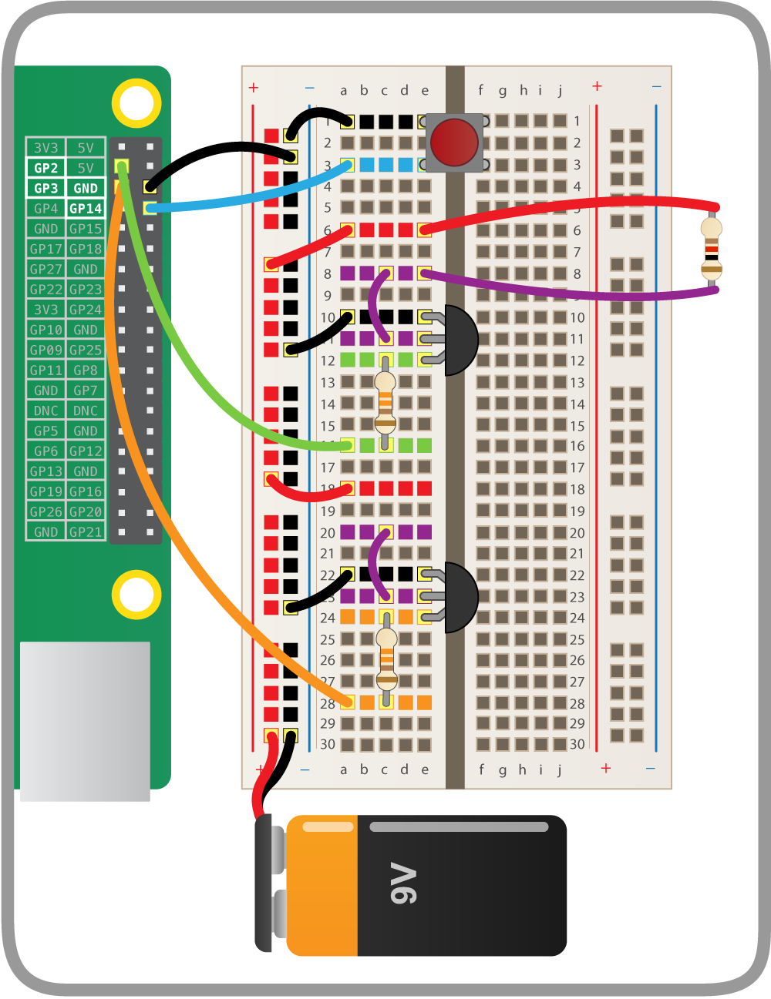

## Set up more balloons

Popping one balloon is good, but popping more balloons is so much better! For each extra balloon you'll need another transistor, another resistor, three male-to-male jumpers, one male-to-female jumper, and space on your breadboard.

- Set up the first balloon as before, replacing the old resistor (it's now burned out!). Leave the rest of the cabling as it is.

- Set up a second balloon with another resistor.

- Add your second transistor to the breadboard and wire it up in the same way as before. Connect the inside leg to the ground rail and its outside leg to GPIO 3 through a 330Ω resistor (leave the middle leg for now):

    

- Now connect the second transistor to the second balloon's resistor:

    

    That's it for the wiring, but you can add more balloons if you like!

