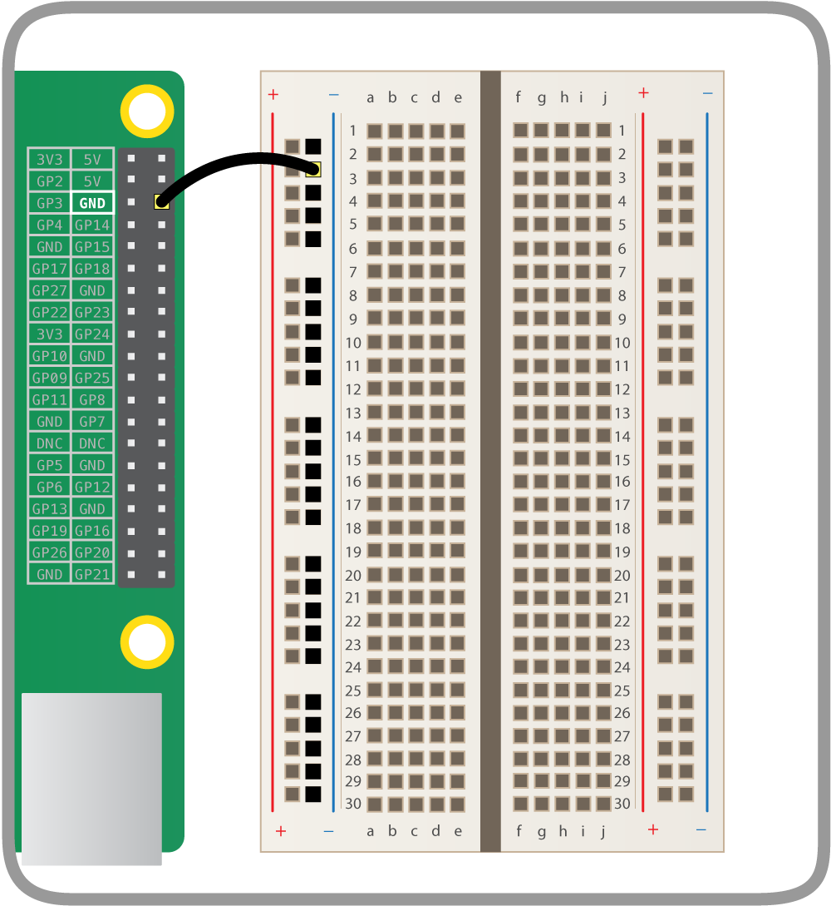
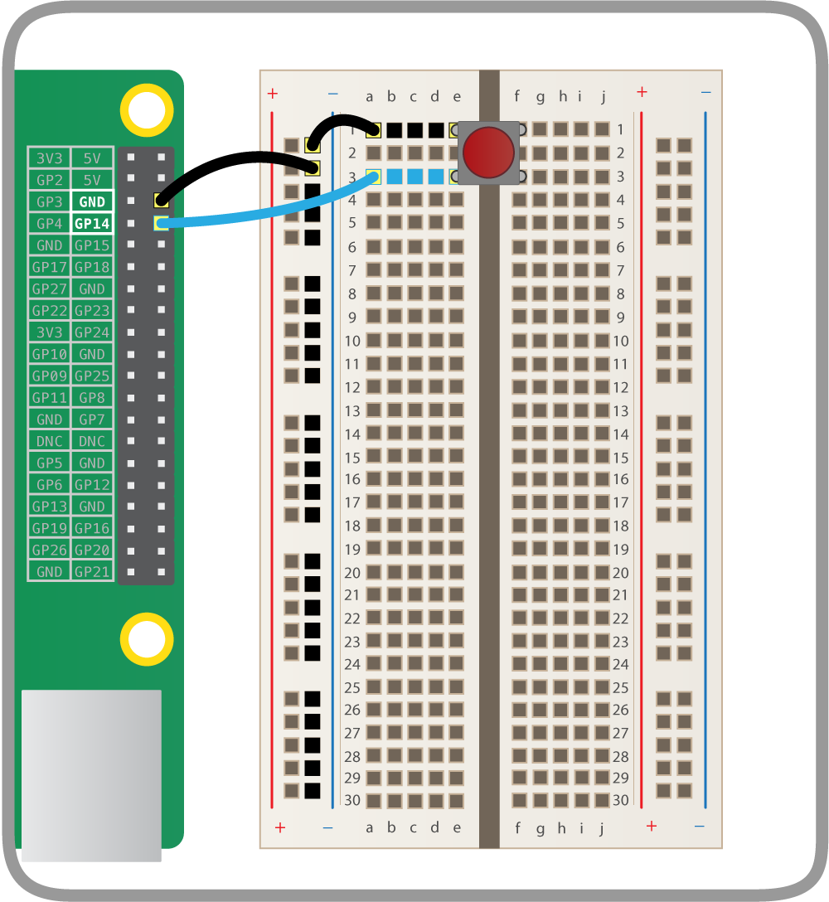

## Wire up a button

First, we'll wire our push button up to the Raspberry Pi.

---- task ---

Take a pin-to-socket jumper cable and connect the Raspberry Pi's ground pin to the breadboard to make a ground rail:

--- /task ---

---- task ---

Place the push button on the breadboard and connect one of its legs to the ground rail, and one to GPIO 14:

--- /task ---

