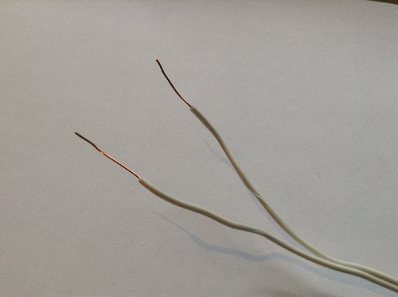

## Set up the balloon popper

We're going to be using a resistor to make the balloon pop.

--- collapse ---

---

title: What are resistors

---

Resistors are electrical components which reduce the current flowing around a circuit, and in doing so they sometimes get hot. You're going to be taking advantage of this heat and deliberately overheating a resistor in order to pop a balloon.

--- /collapse ---

--- task ---

Inflate a balloon so it's nice and full, then tie a knot in it.

--- /task ---

--- task ---

Take two wires, each about 2 metres in length and strip both ends, so the bare wires is visible.

--- /task ---

--- task ---

Take a 12Ω resistor and the stripped end of the wire. Twist one wire of the cable around one leg coming from the resistor, and the other wire around the other leg coming from the resistor; it doesn't matter which wire is connected to which, just make sure the two ends of the wire do not touch each other.

Make sure that there's a firm connection; you can even wrap electrical tape around the twisted wire to ensure it stays in place.

--- /task ---

--- task ---

Take some more electrical tape (it doesn't matter what colour you use) and tape the resistor firmly onto the most stretched part of the balloon; that's the balloon's side, as in the picture below. It's important that this resistor is firmly touching the balloon, so stick it on carefully.

Now tie some string onto the knot of your balloon and hang it from the ceiling using tape or Blu-Tack.

--- /task ---

