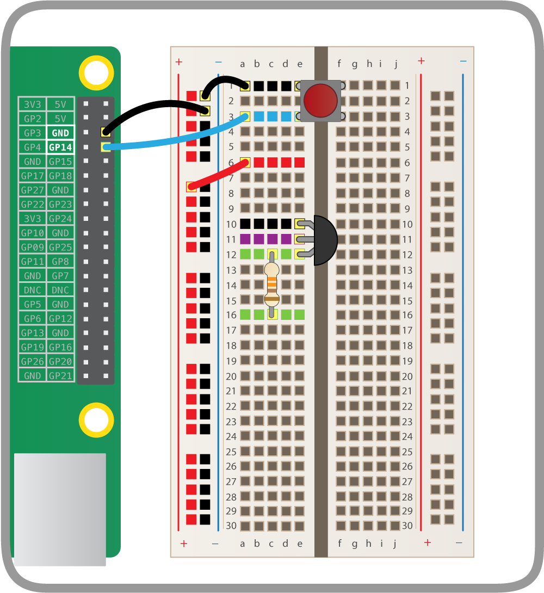
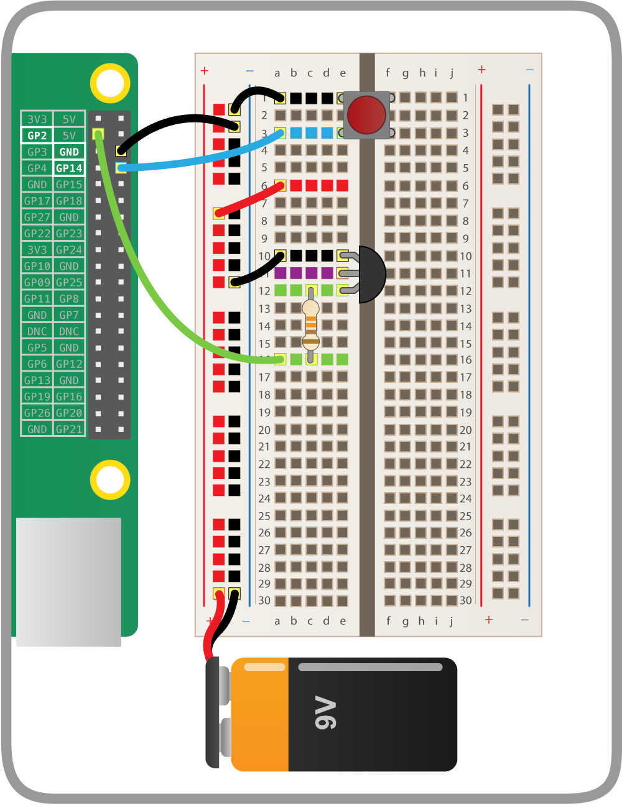

## Connect the transistor

--- collapse ---

---

title: Transistors

---

The voltage of a circuit is the amount of 'push' the current has: a higher voltage provides a bigger push, which usually results in more current flowing in the circuit. Here, in order to make the resistor hot enough to pop the balloon, we need to run a higher current through them than the voltage on the Raspberry Pi can provide, and to do this we'll use a device called a transistor.

A transistor allows you to 'amplify' a circuit, as they can be switched 'on' by a low-voltage circuit, and once 'on' they allow a higher-voltage circuit to flow. However, it's important that they're wired up correctly.

Hold your transistor up and you'll see that it's a semi-circular shape, with three leads coming out the bottom. Each of these leads has a different name and role.

The base controls the transistor and if it receives a signal (a small voltage) it turns the transistor 'on', allowing current from a higher-voltage circuit to flow between the collector and the emitter.

** Please note: some models of transistors have the legs in a different order. If you're not using BC635 transistors then you must look at the datasheet to check that your wiring is correct. Incorrect wiring could damage your Pi or the transistor, or make your balloon pop too early!**

--- /collapse ---

--- task ---

Hold the BC635 transistor with the flat side facing towards you: from left to right the leads are called the emitter, the collector, and the base.

--- /task ---

--- task ---

Carefully place the transistor onto the breadboard, with the flat side facing the ground rail and a 330Ω resistor connected to the base, like so:

Be sure to place one leg in each hole in the same row.

--- /task ---

--- task ---

Now connect the top leg of the transistor to the ground rail, and the bottom leg of the 330Ω resistor to GPIO 2 on the Raspberry Pi:

--- /task ---

