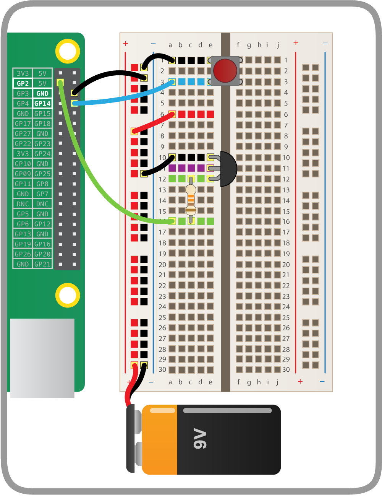
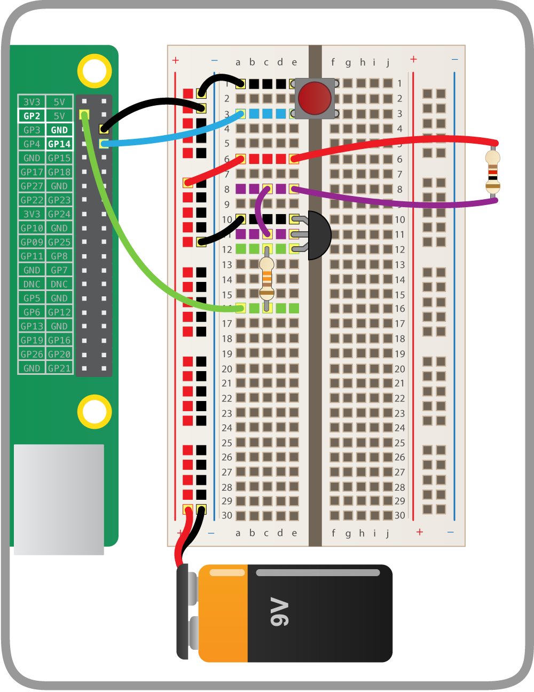

## Connect the balloon

Now we're going to use a 9V battery. We need 9 volts for the resistor to get hot enough to pop the balloon!

---- task ---

Place the battery in the battery snap. Connect its black lead into the ground rail and the red lead into the power rail on your breadboard - that's the red one adjacent to the ground rail.

--- /task ---

---- task ---

We want this circuit to go through the resistor attached to the balloon. Connect it to the breadboard in the space between the button and the transistor:

--- /task ---

---- task ---

Now connect one side of the resistor to the middle leg of the transistor, and the other side to the 9V power rail:

This circuit is now complete. The current will flow from the battery, through the resistor to the collector leg of the transistor, out the emitter leg and then back to ground. As the current flows through the resistor, it will heat it up so much that the balloon will pop.

--- /task ---

