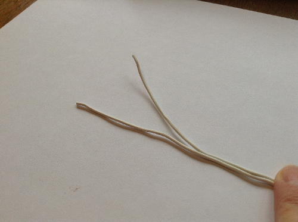
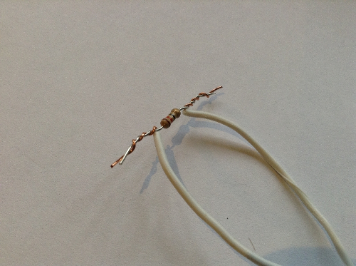
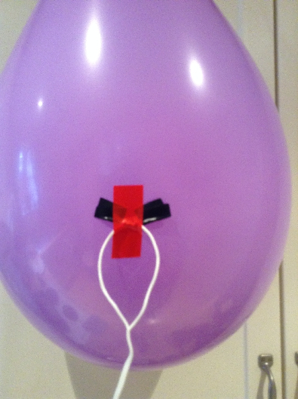

## Set up the balloon popper

We're going to be using a resistor to make the balloon pop. Resistors are electrical components which reduce the current flowing around a circuit, and in doing so they sometimes get hot. You're going to be taking advantage of this heat and deliberately overheating a resistor in order to pop a balloon. Before you can do that, though, you need to wire up the resistor:

- Inflate a balloon so it's nice and full, then tie a knot in it.

- Take 2 metres of 2-core speaker cable and strip both ends of both cores so that the bare wire is visible: strip 1 cm of insulation off one end (the end we'll connect to the breadboard) and about 3 cm off the other end (the end we'll connect to the 12Ω resistor). This can be done with wire strippers or, if you're very careful, with scissors - make sure that you only cut through the insulation and not the wires themselves. You can also split the two cores of the cable a little by simply pulling them apart.

    

    

- Take a 12Ω resistor and the 3 cm stripped end of the speaker cable. Twist one wire of the cable around one wire coming from the resistor, and the other wire around the other wire coming from the resistor; it doesn't matter which wire is connected to which, just make sure the two ends of the wire do not touch each other.

    Make sure that there's a firm connection; you can even wrap electrical tape around the twisted wire to ensure it stays in place.

    

- Now, take some more electrical tape (it doesn't matter what colour you use) and tape the resistor firmly onto the most stretched part of the balloon; that's the balloon's side, as in the picture below. It's important that this resistor is firmly touching the balloon, so stick it on carefully.

    

    

- Now tie some string onto the knot of your balloon and hang it from the ceiling using tape or Blu-Tack.

