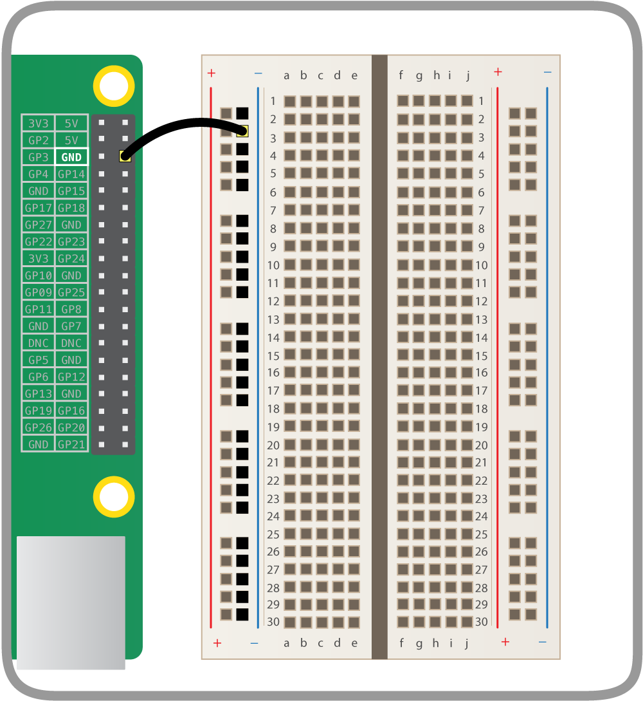
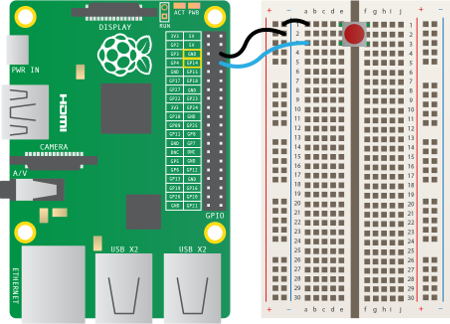
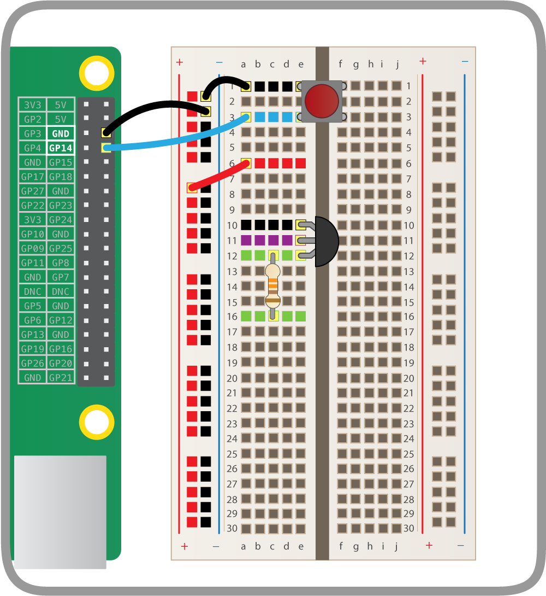
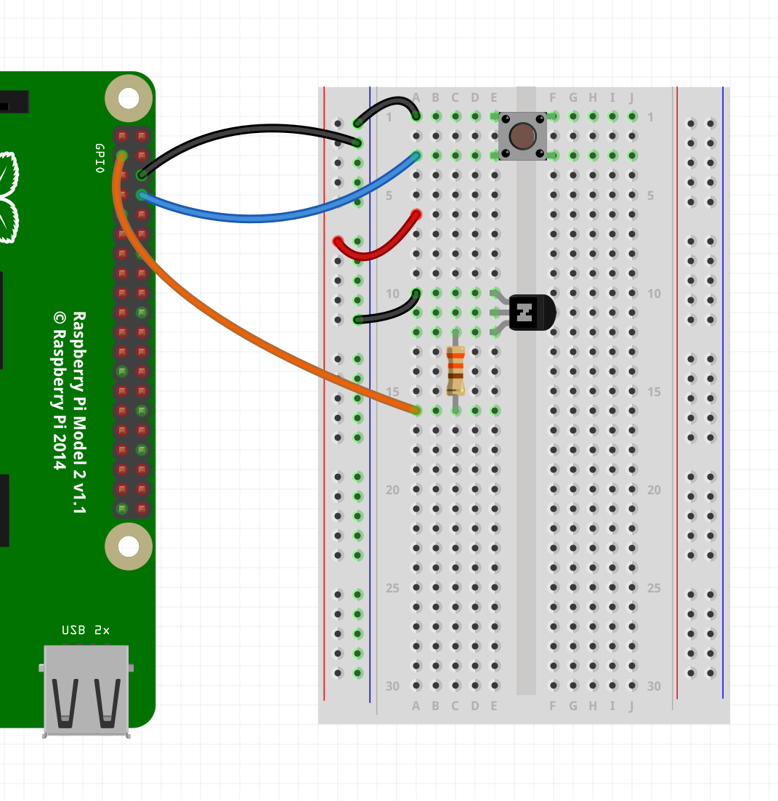
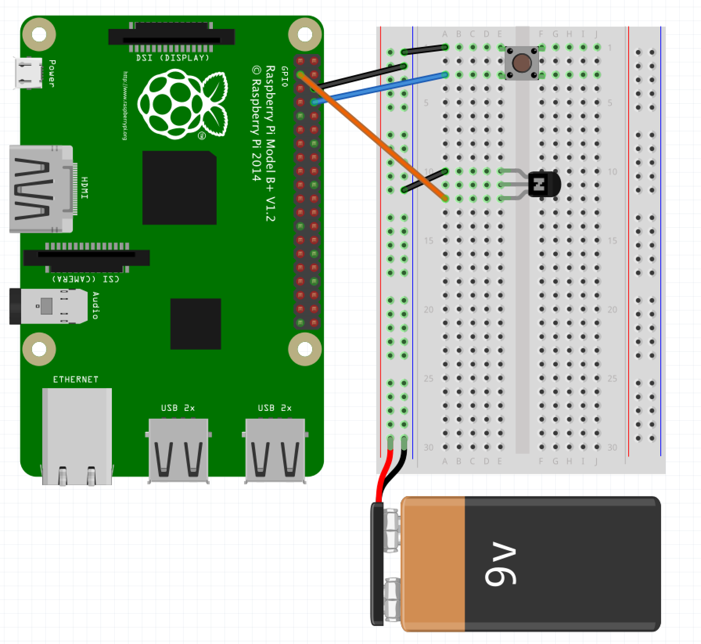
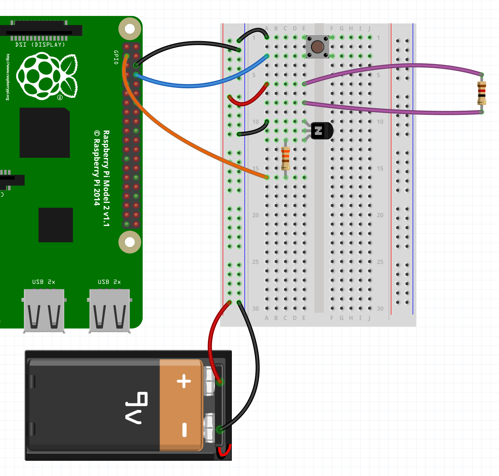
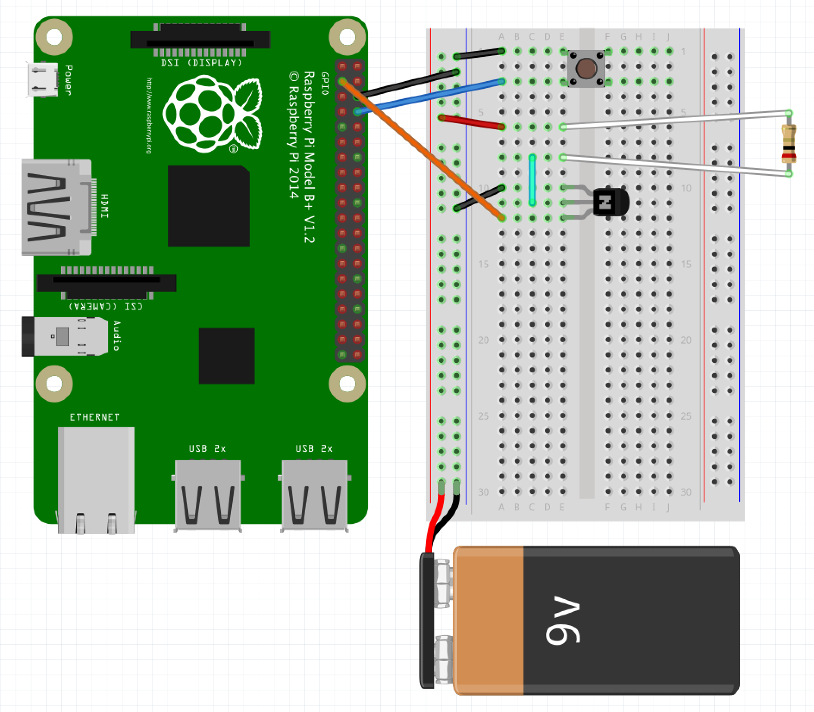
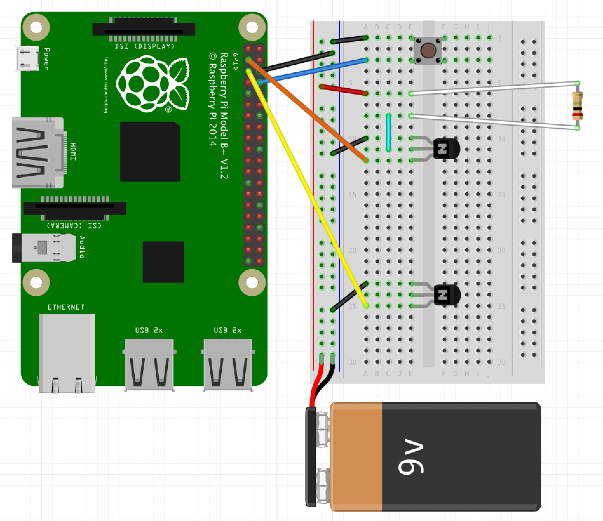
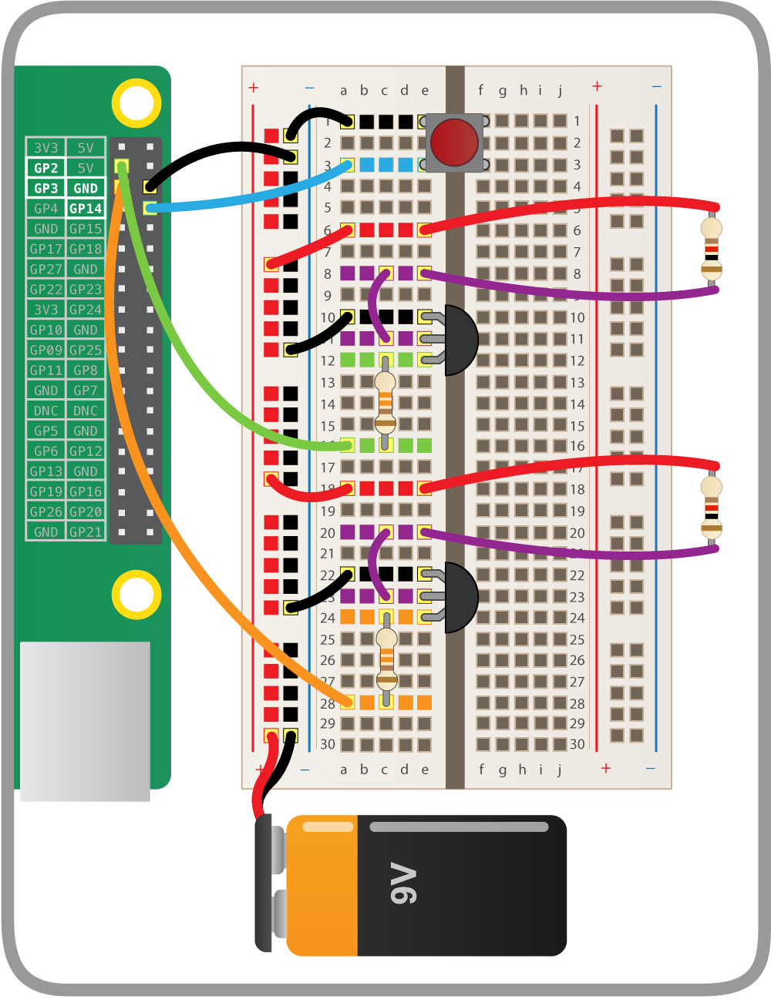

# Balloon Pi-tay Popper

To pop balloons you might usually use a pin. Here you'll be doing the same, but using a GPIO 'Pin' on your Raspberry Pi, not the pin you might be thinking of!

## Wire up a button

First we'll wire up our push button to the Raspberry Pi.

1. Take a male-to-female jumper cable and connect the Raspberry Pi's ground pin to the breadboard to make a ground rail:

    

1. Place the push button on the breadboard and connect one of its legs to the ground rail, and one to GPIO pin 14:

    

## Test the button with code

Now we've connected a button, we'll activate it with some Python code.

1. Open up LXTerminal from the desktop or application menu.

1. Once the LXTerminal is opened, type in `sudo idle3 &` and press `Enter`. This will open up a Python Shell with super user permissions (you need these to access the GPIO pins).

1. In this Python Shell go to `File -> New Window` to open a new Python file.

1. It's good practice to save this file before you type anything important. To save go to `File -> Save As`, then type in `balloon.py`, and click `Save`. Now you can get coding!

1. Start by importing the Raspberry Pi GPIO library. Write the following line in your Python file:

    ```python
    import RPi.GPIO as GPIO
    ```

1. Next leave a new line space to separate your imports from your main code, and add a line to set the GPIO pin mode:

    ```python
    GPIO.setmode(GPIO.BCM)
    ```

    This states that you'll be using the BCM (Broadcom) numbering system to communicate with the GPIO pins, rather than the BOARD numbering system.

1. Also add a line to turn GPIO warnings off:

    ```python
    GPIO.setwarnings(False)
    ```

    This means that when you run the script multiple times, it won't tell you off for setting the same pins up again.

1. Now you'll tell the Raspberry Pi which GPIO pin you'll use for the button. Leave another line break and add the following lines:

    ```python
    button = 14
    ```

1. Leave another line break and set up the GPIO pin your push button is connected to (GPIO pin 14) as an input device:

    ```python
    GPIO.setup(button, GPIO.IN, GPIO.PUD_UP)
    ```

    This tells the Raspberry Pi to treat GPIO pin 14 (the one the button will be connected to) as a 'pulled up' input device.

1. Now add the following lines:

    ```python
    print("Ready...")
    GPIO.wait_for_edge(button, GPIO.FALLING)
    print("Pop!")
    ```

    This will print "Ready", wait for the button to be pressed, then print "Pop!" which will be our balloon popping later!

1. Save the code with `Ctrl + S` and run with `F5`. When you see `Ready...` on the screen, press the button and you should see `Pop!` printed to the screen.

## Set up the balloon popper

We're going to be using a resistor to make the balloon pop. Resistors are electrical components that reduce the current flowing around a circuit, and in doing so they sometimes get hot. You're going to be taking advantage of this heat and deliberately overheating a resistor in order to pop a balloon. But before you can do that you need to wire up the resistor:

1. Inflate a balloon so it's nice and full, then tie a knot in it.

1. Take a 2 metre length of 2 core speaker cable and strip both ends of both cores, so that the bare wire is visible. This can be done with wire strippers or (very carefully) with scissors (make sure that you only cut through the insulation and not the wires themselves). You can also split the two cores of the cable a little simply by pulling them apart. At one end of the cable, wrap red electrical tape around one wire (not the part with the exposed wire), and black electrical tape around the other. This is just to label them for later.

    

    

1. Take a 12R resistor and the ends of the speaker cable without electrical tape around them. Twist one wire of the cable around one wire coming from the resistor, and the other wire around the remaining wire coming from the resistor; it doesn't matter which wire is connected to which.

    Make sure that there is a firm connection; you can even wrap electrical tape around the twisted wire to ensure it stays in place.

    

1. Now, take some more electrical tape (it doesn't matter what colour) and tape the resistor firmly onto the most stretched part of the balloon (that's the balloon's side- see picture). It's important that this resistor is firmly touching the balloon, so stick it on carefully.

    

    

1. Now tie some string onto the knot of your balloon and hang it from the ceiling using tape or Blu-tack.

## Connect the transistor

The voltage of a circuit is the amount of 'push' the current has; a higher voltage provides a bigger push, which usually results in more current flowing in the circuit. Here, in order to make the resistors hot enough to pop the balloons, we need to run a higher current through them than the voltage on the Raspberry Pi can provide, and to do this we'll use what's called a transistor.

A transistor allows you to 'amplify' a circuit, as they can be switched 'on' by a low voltage circuit, and once 'on' they allow a higher voltage circuit to flow. However, it's important that they're wired up correctly.

Hold your transistor up and you'll see that it's a semi-circle shape, with three leads coming out the bottom. Each of these leads has a different name and role.

The base controls the transistor and if it receives a signal (a small voltage) it turns the transistor 'on', allowing current (from a higher voltage circuit) to flow between the collector and the emitter:

** Please note: some models of transistors have the legs in a different order. If you are not using BC635 transistors then you must look at the datasheet to check they are correct. Wiring up incorrectly could mean you'll damage your Pi or the transistor, or pop your balloon too early!**

Hold the BC635 transistor with the flat side facing towards you; from left to right the leads are called the emitter, the collector and base.


1. Carefully place the transistor onto the breadboard with the flat side facing the ground rail like so:

    

    Be sure to place one leg in each hole in the same row.

1. Now connect the top leg of the transistor to the ground rail and the bottom leg to GPIO pin 2 on the Raspberry Pi:

    

## Connect the balloon

Now we're going to use a 9V battery. We need 9 volts for the resistor to get hot enough to pop the balloon!

1. Place the battery in the battery snap. Connect its black lead into the ground rail and the red lead into the power rail on your breadboard - that's the red one adjacent to the ground rail.

    

1. We want this circuit to go through the resistor attached to the balloon. Connect it to the breadboard in the space between the button and the transistor:

    

1. Also connect one side of the resistor to the middle leg of the transistor, and the other side to the 9V power rail:

    

    This circuit is now complete. The current will flow from the battery, through the resistor, to the collector leg of the transistor, out the emitter leg and then back to ground. As it flows through the resistor it will heat it up so much that the balloon will pop.

## Add balloon to the code

Now we've completed our circuit we'll need to change our code to trigger the transistor, allowing current to flow through the resistor, which will pop the balloon.

1. Where you previously declared `button = 14`, add a line to declare `balloon = 2`:

    ```python
    button = 14
    balloon = 2
    ```

    This will designate GPIO pin 2 to what we'll use to pop the balloon.

1. Next where we set up the button pin as an input device, we'll also set up the balloon pin as an output device:

    ```python
    GPIO.setup(button, GPIO.IN, GPIO.PUD_UP)
    GPIO.setup(balloon, GPIO.OUT)
    ```

1. Now comes the code to pop the balloon. Before we used `wait_for_edge` to wait for a button press, then we just printed `Pop!`. Add a new line before the `Pop!` line:

    ```python
    GPIO.output(balloon, True)
    sleep(5)
    GPIO.output(balloon, False)
    ```

    This means "Turn the balloon pin on for 5 seconds, then turn it off".

1. In order to use the `sleep` function we need to import it from the `time` library. Return to the very top of the code where you imported the `GPIO` library and add:

    ```python
    import RPi.GPIO as GPIO
    from time import sleep
    ```

1. Now save your code with `Ctrl + S` and check everything's wired up as it should be! Then run your code with `F5`. When you see `Ready...`, press the button and your balloon should burst!

## Set up more balloons

Popping one balloon is good, but popping more balloons is so much better! For each extra balloon you'll need another transistor, resistor, 3 male-to-male jumpers and 1 male-to-female jumper (and space on your breadboard).

1. Set up the first balloon as before, replacing the old resistor (it's now burned out!) leaving the rest of the cabling as it was.

1. Set up a second balloon with another resistor.

1. Add your second transistor to the breadboard and wire it up in the same way as before, connecting the inside leg to the ground rail and its outside leg to GPIO pin 3 (leave the middle leg for now):

    

1. Now connect the second transistor to the second balloon's resistor:

    

    That's it for the wiring - but you can add more balloons if you like!

## Code more balloons

Now we'll return to the code and make a few small adjustments to make it pop more balloons!

1. Where we previously used `balloon = 2` to store the GPIO pin for the first balloon, we'll now use a list to store the pin numbers of all the balloons we're using:

    ```python
    balloons = [2, 3]
    ```

1. Now instead of just setting up one GPIO pin for the one balloon, make it do the `setup` function for every balloon in the list:

    ```python
    for balloon in balloons:
        GPIO.setup(balloon, GPIO.OUT)
    ```

1. Then instead of just popping one balloon we'll make it pop them all in turn:

    Instead of:

    ```python
    print("Popping...")
    GPIO.output(balloon, True)
    sleep(5)
    GPIO.output(balloon, False)
    ```

    We'll use:

    ```python
    for balloon in balloons:
        print("Armed...")
        GPIO.output(balloon, True)
        sleep(5)
        GPIO.output(balloon, False)
    ```

## What next?

Other stuff to try:

- Try changing the order the balloons pop in. To do this just change the order the GPIO pin numbers are used.

- Convert your balloon popper into an interactive calculator. The wiring up is exactly the same, but the code is slightly different.
