# Balloon Pi-tay Popper

To pop balloons use may usually a pin. Here you'll be doing the same, but using a GPIO 'Pin' on your Raspberry Pi, not the pin you might be thinking of!

## Set Up the Balloon Poppers

We're going to be using resistors to make the balloons pop. Resistors are electrical components that reduce the current flowing around a circuit, and in doing so they sometimes get hot. You're going to be taking advantage of this heat and deliberately over-heating a resistor in order to pop a balloon. But, before you can do that you need to wire up the resistor:

1. Inflate a balloon so it's nice and full, then tie a knot in it.

1. Take a 2 metre length of 2 core speaker cable and strip both ends of both cores, so that the bare wire is visible. This can be done with wire strippers or (very carefully) with scissors (make sure that you only cut through the insulation and not the wires themselves). You can also split the two cores of the cable a little simply by pulling them apart. At one end of the cable, wrap red electrical tape around one wire (not the part with the exposed wire), and black electrical tape around the other. This is just to label them for later.

    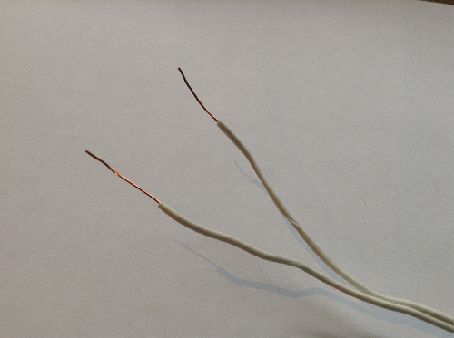

    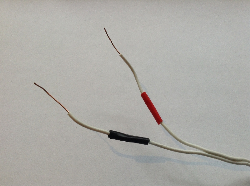

    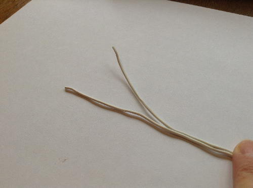

1. Take a 12R resistor and the ends of the speaker cable without electrical tape around them. Twist one wire of the cable around one wire coming from the resistor and the other wire around the remaining wire coming from the resistor (it doesn't matter which wire is connected to which).

    Make sure that there is a firm connection, you can even wrap electrical tape around the twisted wire to ensure it stays in place.

    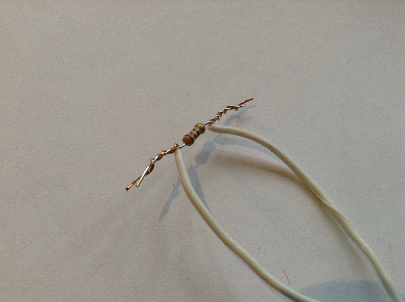

    

1. Now, take some more electrical tape (is doesn't matter what colour) and tape the resistor firmly onto the most stretched part of the balloon (that's the balloon's side, see picture). It's important that this resistor is firmly touching the balloon, so stick it on carefully.

    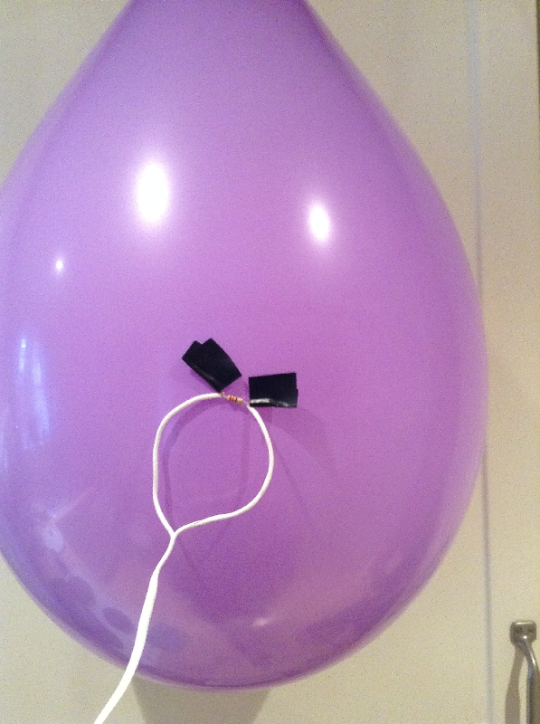

    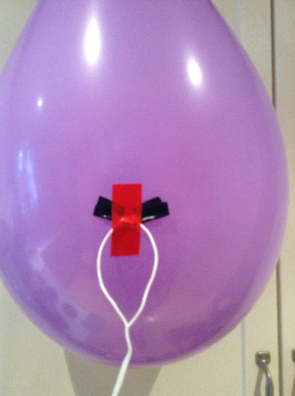

1. Now tie some string onto the knot of your balloon and hang it from the ceiling using tape or tack.

## Wire Up the Low Voltage Circuit

The voltage of a circuit is the amount of 'push' the current has; a higher voltage provides a bigger push, which usually results in more current flowing in the circuit. Here, in order to make the resistors hot enough to pop the balloons, we need to run a higher current through them than the voltage on the Raspberry Pi can provide, and to do this we'll use what's called a Transistor.

A Transistor allows you to 'amplify' a circuit, as they can be switched 'on' by a low voltage circuit, and once 'on' they allow a higher voltage circuit to flow, but it's important that they're wired up correctly.

1. Hold your transistor up and you'll see that it's a semi-circle shape, with three leads coming out the bottom, each of these leads has a different name and role. Hold the transistor with the flat side facing towards you and from left to right the leads are called the Collector, the Base and the Emitter. The middle lead (the Base) controls the transistor and if it receives a signal (a small voltage) it turns the transistor 'on',  allowing current (from a higher voltage circuit) to flow between the Collector (on the left) and the Emitter (on the right).

    [Note: this is true for P2N2222A transistor, but others transistors may have their leads in different positions]

    Like this:

    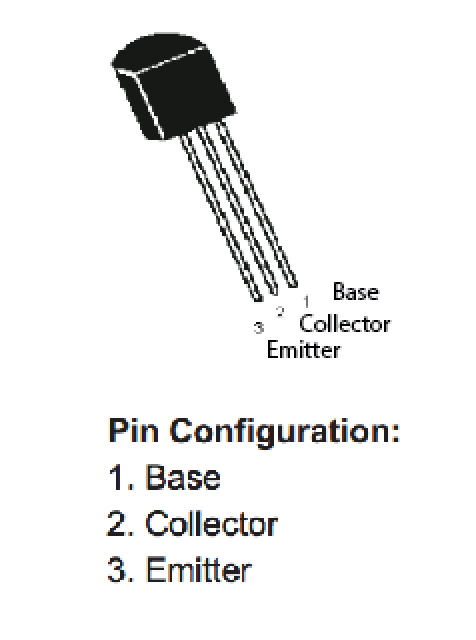

1. Now you know which lead is which, we need to wire up the transistor; gently separating the leads will help with this. Carefully insert the leads into holes in the same column (i.e. column 'D') on your breadboard.

    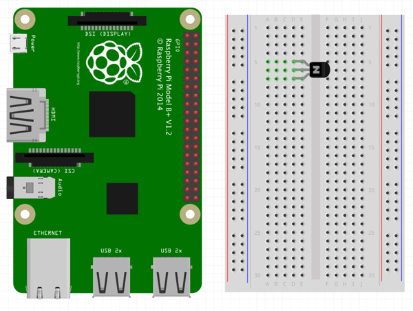

1. You now need to wire up your transistor to a GPIO pin on your Raspberry Pi. These pins each have different numbers, so look at the diagram below and figure out which GPIO pin on your Raspberry Pi is which number. We want GPIO pin number 2. So take a male-to-female jumper cable and connect the female end onto GPIO pin number 2 on your Raspberry Pi, then insert the male end into the breadboard. It needs to connect with the Base lead of the transistor, so insert it into the same row as that (remember the Base lead is the middle lead on the transistor).

    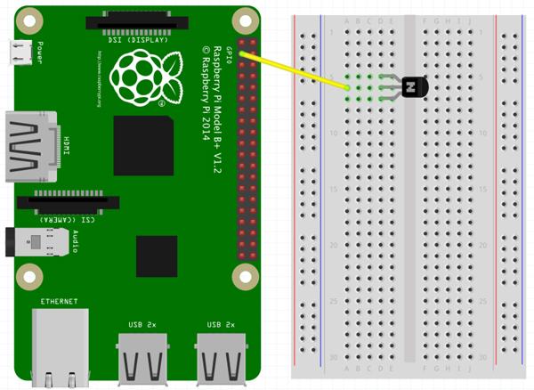

1. In order to complete the circuit coming from that GPIO pin we need to connect it to ground. So, using a male-to-male jumper cable, insert one end into the same row as the Emitter lead of the transistor and the other to the ground rail on your breadboard (that's the one of the columns that has a '-' sign on it (they're usually at the end of the board, and are usually black).

    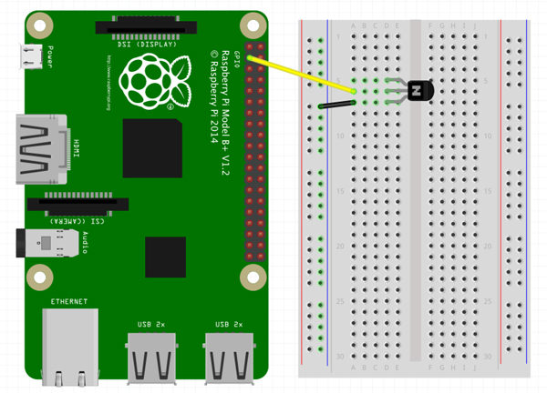

Then take a female-to-male jumper cable and insert one end again into this ground rail and attach the other end onto a ground GPIO pin on your Raspberry Pi (so that's any pin with a '– ' sign or labelled GND - see the earlier diagram).

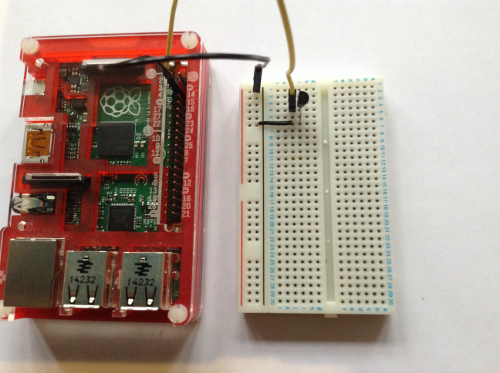

The circuit is now complete between GPIO PIN number 2, through the base lead of transistor, onto the emitter lead and then back to ground. This circuit is our low voltage circuit, but as we said before we also need a high(er) voltage circuit to heat up the resistor enough. . 

## Wire Up the Higher Voltage Circuit

For this high(er) voltage circuit, we're going to use a 9 volt battery. 

1. Attach a battery snap onto a 9 volt battery and place the black lead into the ground rail (the same one as you used before) and the red lead into the power rail on your breadboard - that's the red one, also usually labelled with a '+' sign.

    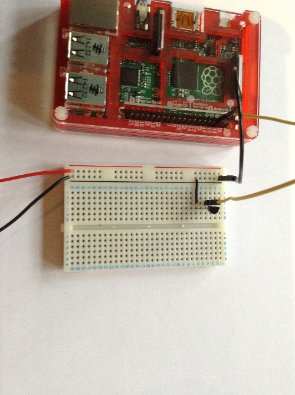

1. We want this circuit to go through the resistor that you wired up in Step 1. So, take the wires with the resistor attached and with the free ends, insert the one with the red tape on into the positive (yes, the same one you just put the battery lead in) and insert the lead with the black tape on into the same row as the Collector lead of the transistor.

    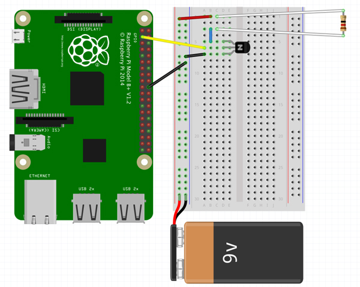

1. This circuit is now complete, the current will flow from the battery, through the resistor, to the Collector lead of the transistor, out the Emitter lead and then back to ground. As it flows through the resistor it will heat it up so much that the balloon will pop.

## Set Up More Balloons

Popping one balloon is good, but popping three balloons, is so much better!

1. Follow the point in Steps 1-3 for two more balloons. However, miss one the first point in Step 3, as you'll be using the same battery for all three resistors.  Also, use different pin number for these balloons:

    - For balloon 2 use GPIO Pin number 3
    - For balloon 3 use GPIO Pin Number 4

    You can label your balloons with a pen so you know which one is which

    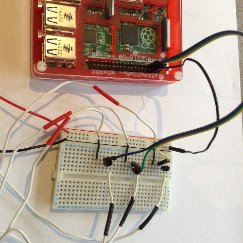

## Wire up an Input Button

This will allow you to have control over when the balloons begin popping.

1. The input button has two wires coming out of its base; insert the button into your breadboard (away from the transistors) so that these wires are in different rows.

    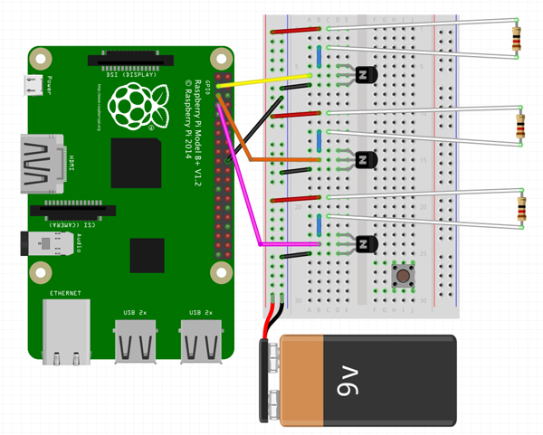

1. Take a jumper cable and insert one end of it into one of these rows the button has just been placed into and insert the other end of this jumper cable into the ground rail (yes, the same one as before…again!)

    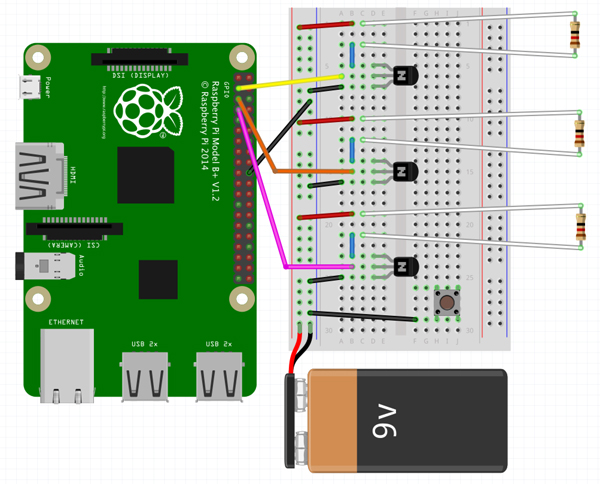

1. Take a male-to-female jumper cable and insert one end into other row used by the button and attach the remaining free end of this cable onto GPIO pin number 14.

    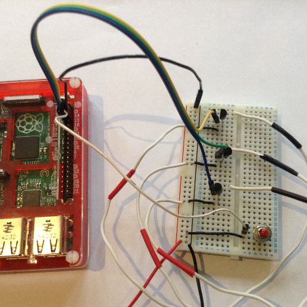

There you have it; all your hardware is complete. It's now time for the coding!

## Code your Balloon Pi-tay Popper

1. In the desktop area of your Raspberry Pi, open up a LX Terminal, either from the dropdown menu, or by double clicking on the 'LXTerminal' icon.

1. Once the LXTerminal is opened, type in `sudo idle3 &` and press `Enter`. This will open up a Python Shell with super user permissions (you need these to access the GPIO pins).

1. In this Python Shell go to `File -> New Window` to open a new Python file.

1. It's good practice to save this file before you type anything important. To save go to `File -> Save As`, then type in `balloon.py`, and click `Save`. Now you can get coding!

1. Start by importing the Raspberry Pi GPIO library. Write the following line in your Python file:

    ```python
    import RPi.GPIO as GPIO
    ```

1. On the next line, import the `time` module's `sleep` function by adding:

    ```python
    from time import sleep
    ```

1. Next leave a new line space after your `import` lines to separate them from your main code, and add a line to set the GPIO pin mode:

    ```python
    GPIO.setmode(GPIO.BCM)
    ```

    This states that you'll be using the BCM (Broadcom) numbering system to communicate with the GPIO pins, rather than the BOARD numbering system.

1. Now you'll tell the Raspberry Pi which GPIO pins you'll use for each purpose. Leave another line break and add the following lines:

    ```python
    button = 14
    balloon_1 = 2
    balloon_2 = 3
    balloon_3 = 4
    ```

1. Leave another line break and set up the GPIO pin your push button is connected to (GPIO pin 14) as an input device:

    ```python
    GPIO.setup(button, GPIO.IN, GPIO.PUD_UP)
    ```

    This tell the Raspberry Pi to treat GPIO pin 14 (the one the button is connected to) as a 'pulled up' input device.

    'PUD_UP' stands for 'pull up or down' and the allocation to 'up'

1. Leave another blank line and now you have to allocate the output pins. As there are 3 balloons, you'll need 3 outputs. To set these up, add them in the same way as the input pin:

    ```python
    GPIO.setup(ballon_1, GPIO.OUT)
    GPIO.setup(ballon_2, GPIO.OUT)
    GPIO.setup(balloon_3, GPIO.OUT)
    ```

1. Because you set your button as a *Pull Up* input, when it's not pushed it's read as being active (the circuit is connected), but when it's pushed, the circuit is broken, so the input goes from high to low. In order to make the code read sensibly, we'll explain this by setting a variable `touched` to equal `GPIO.LOW`:

    ```python
    touched = GPIO.LOW
    ```

1. Also add a message to let you know when it's ready to receive a button press:

    ```python
    print("Ready...")
    ```

1. Now you can write the code that will switch on your transistors, which in turn will make the balloons pop. First of all we only need the balloons to pop once so to ensure this is the case, add a new line and type the following:

    ```python
    while True:
        if GPIO.input(button) == touched:
            print("Button Pushed")
            sleep(1)
            break
    ```

    This block of code is designed to test the effect of the button. `while True` means "keep going forever" and it checks to see if the button has been pressed, and prints `Button Pushed` when it has been, then `break` ends the loop.

1. Add this line to the very bottom of your code (with no indentation):

    ```python
    GPIO.cleanup()
    ```

    This makes it forget all the GPIO setup information, so that it doesn't give warnings next time you run the file and set the pins up again.

1. Save the code with `Ctrl + S` and run with `F5`. Press the button and you should see `Button Pushed` printed to the screen.

1. Now for the outputs. You'll need to add all the following lines between `sleep(1)` and the `break` line:

    ```python
    GPIO.output(balloon_1, True)
    print('Balloon 1')
    sleep(5)
    GPIO.output(balloon_1, False)

    GPIO.output(balloon_2, True)
    print('Balloon 2')
    sleep(5)
    GPIO.output(balloon_2, False)

    GPIO.output(balloon_3, True)
    print('Balloon 3')
    sleep(5)
    GPIO.output(balloon_3, False)
    i += 1
    ```

    This code will switch each of the output pins on, wait 5 seconds, turn then it off again and move on to the next one. This will result in each of the balloons exploding in sequence, five seconds apart.

    Note: the five seconds is needed for the resistor to get hot enough in order to pop the balloons!

1. Save your program again with `Ctrl + S`.

## Run your Balloon Pi-tay Popper

1. You're almost ready to go, ensure that all your wires are in place and the resistors are still firmly taped onto the balloons.

1. Then with your code still open press `F5`.

1. When you see `Ready` printed to the screen, it is ready to receive your input. So, when you're ready, press your button and watch the balloons pop ... pop ... POP!

## What next?

Other stuff to Try:

- Try changing the order the balloons pop in. To do this just change the order the GPIO pin numbers are used in.

- Convert your balloon popper into a rather addictive Interactive Calculator. The wiring up is exactly the same, but the code is slightly different, see this worksheet for how to make it.
